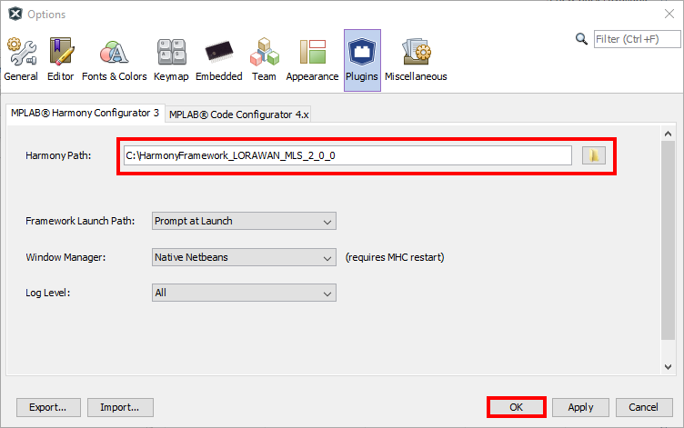
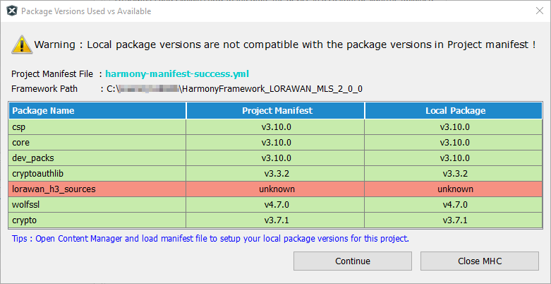
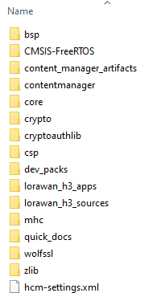
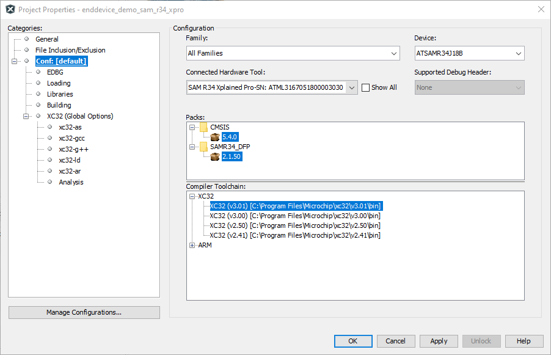
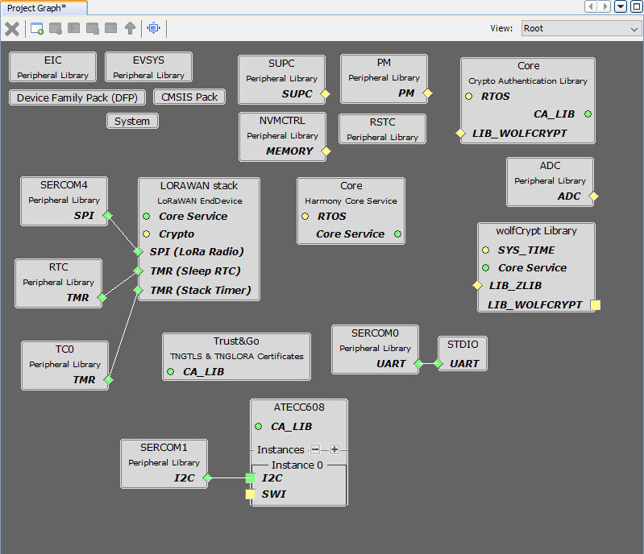
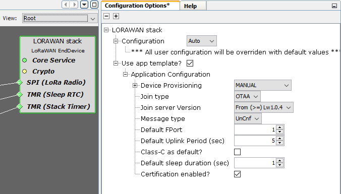
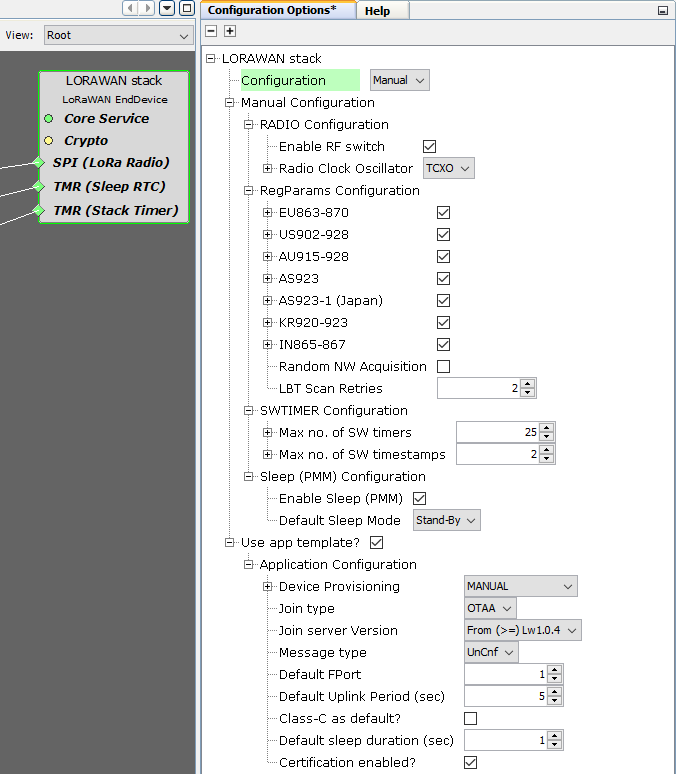

# ATSAMR34_LORAWAN_H3


> "Wireless Made Easy!" - Microchip LoRaWAN Stack Opened for SAM R34 IC and WLR089U0 Module running on Microchip MPLAB X IDE

Devices: | **ATSAMR34 | WLR089U0**

<p align="left">
<a href="https://www.microchip.com" target="_blank">
</a>
<a href="https://www.microchip.com/lora" target="_blank">
</a>

</p>

## ⚠ Disclaimer

<p><span style="color:red"><b>
THE SOFTWARE ARE PROVIDED "AS IS" AND GIVE A PATH FOR SELF-SUPPORT AND SELF-MAINTENANCE.</br></br>
This repository contains unsupported example code intended to help accelerate client product development. It is not validated for production nor audited for security best-practices.</br></br>
Note that while this repository is unsupported, Microchip welcome community contributions, and all pull-requests will be considered for inclusion into the repository.
</span></p></b>

> Interact with peers in the community at [LoRa Forum](https://www.microchip.com/forums/f512.aspx).


## Resources

- [SAMR34/35 and WLR089U Landing page](https://www.microchip.com/design-centers/wireless-connectivity/low-power-wide-area-networks/lora-technology/sam-r34-r35)
- [SAMR34 Device page](https://www.microchip.com/wwwproducts/en/ATSAMR34J18)
- [SAMR34 Xplained Pro Evaluation Kit](https://www.microchip.com/DevelopmentTools/ProductDetails/dm320111)
- [WLR089U0 Module page](https://www.microchip.com/wwwproducts/en/WLR089U0)
- [WLR089U0 Module Xplained Pro Evaluation Kit](https://www.microchip.com/EV23M25A)
- [Microchip MPLAB X IDE](https://www.microchip.com/en-us/development-tools-tools-and-software/mplab-x-ide)
- [MPLAB Harmony v3](https://www.microchip.com/en-us/development-tools-tools-and-software/embedded-software-center/mplab-harmony-v3)

[Clone/Download](https://docs.github.com/en/free-pro-team@latest/github/creating-cloning-and-archiving-repositories/cloning-a-repository) the current repo to get the package.

## A la carte

1. [Introduction](#step1)
1. [Hardware Platforms](#step2)
1. [LoRaWAN Certification Test Tool](#step3)
1. [Package Overview](#step4)
1. [Software Environment Setup](#step5)
1. [Sample Applications](#step6)
   1. [LoRaWAN Mote Application](#step6a)
   1. [RN Command Parser](#step6b)
   1. [RN Command Parser + ATECC608B_TNG](#step6c)
<!-- 1. [Create a project from scratch](#step7)-->

## Introduction<a name="step1"></a>

The Microchip LoRaWAN™ Stack (MLS) provides a solution for the LoRaWAN end-device that is used for Internet of Things (IoT) applications.

LoRa® is a wireless modulation technique designed to allow low-power end-devices to communicate over long range and at low data rates.

LoRaWAN is a wireless networking protocol which operates over LoRa communication layer and acts as Medium Access Control (MAC) layer.

LoRaWAN specification and its development is overseen by LoRa Alliance™. The specification is meant for secure communication of end-devices and ensures inter-operability within the LoRa network.

Microchip LoRaWAN Stack is Opened for SAM R34 IC and WLR089U0 Module where MAC and Radio layers are both provided as source code for self-support and self-maintenance.

MLS v2.0.0 release is pre-tested against LoRaWAN 1.0.4 Class A using official LoRa Alliance Test Tool (LCTT).

## Hardware Platforms<a name="step2"></a>

* Purchase the [SAM R34 Xplained Pro Evaluation Kit](https://www.microchip.com/en-us/development-tool/DM320111)</br></br>


* Purchase the [WLR089U0 Xplained Pro Evaluation Kit](https://www.microchip.com/en-us/development-tool/EV23M25A)</br></br>


* Purchase a LoRa Gateway

* If using a Join Server with security solution for LoRaWAN, a pre-provisioned ATECC608 secure element is required. Purchase the Trust&GO secure element [ATECC608B-TNGLORA](https://www.microchip.com/en-us/product/ATECC608B-TNGLORA) for TTI Join Server or the [ATECC608B-TNGACT](https://www.microchip.com/en-us/product/ATECC608B-TNGACT) for Actility Join Server and the [CryptoAuthentication Socket Kit](https://www.microchip.com/en-us/product/ATECC608B-TNGLORA)


## LoRaWAN Certification Test Tool<a name="step3"></a>

The LoRa Alliance® has developed a LoRaWAN® Certification Test Tool (LCTT) for all LoRa Alliance® device manufacturers to pre-test their devices before sending them to the Authorised Test Houses (ATHs) for formal LoRaWAN® Certification testing. 

The LoRaWAN® certification tests for end node functionality, in other words it tests that node’s LoRaWAN protocol stack and application are compliant with the LoRaWAN specification.

Checkout the [LoRa Alliance](https://lora-alliance.org/lorawan-certification/) for more details.

<b><p>
The present software has been PRE-TESTED against the LoRaWAN® L2 Specification 1.0.4 (Class A only) for the following regions:
- EU863-870</br>
- US902-928</br>
</p></b>
And using the following setup:

- LCTT version: LCTT v3.1.0_D1 | GUI v1.10.0
- Gateway(s) used for EU campaign (OTAA, ABP): Picocell GW and Semtech GW (Picocell GW for all tests except SF12 steps)
- Gateway(s) used for NA campaign (OTAA, ABP): Picocell GW
- SAMR34 Xplained Pro Rev 4
- WLR089U0 Xplained Pro Rev A/01
- All testing have been done in Application mode using the **LoRaWAN Mote Application** since the LoRaWAN 1.0.4 test specification elaborated and standardised the command communication between the test Network Server and the test End Device.

> For reference, checkout the folder `MLS_SDK_2.0.0_Release/LCTT_TestReports` and get access to the test reports.


## Package Overview<a name="step4"></a>

The Microchip LoRaWAN Stack contains:
* **LoRaWAN Enddevice Demo (with certification mode & pre-provisioned ATECC608 support)**: A 32-bit MPLAB Harmony 3 Project, which provides a reference application
* **RN-style Parser**: A 32-bit MPLAB Harmony 3 project
* The LoRaWAN stack components in source code
* Drivers, software timer, PDS, PMM and radio drivers for the LoRaWAN stack
* The facility to support dynamic regional band switching within the supported bands

The applications are located in `lorawan_h3_apps` folder and organized as below:

```bash
lorawan_h3_apps/
├───enddevice_demo/
│   └───sam_r34_xpro/
│       └───firmware/
│           ├───enddevice_demo_sam_r34_xpro.X/
│           └───src/
├───parser
│   └───sam_r34_xpro/
│       └───firmware/
│           ├───parser_sam_r34_xpro.X/
│           └───src/
└───parser_ecc608
    └───sam_r34_xpro/
        └───firmware/
            ├───parser_sam_r34_xpro.X/
            └───src/
```

Checkout the [Application Release Notes](MLS_SDK_v2.0.0_Release/Harmony_LoRaWAN_MLS_2_0_0/lorawan_h3_apps/release_notes.md#top)

MLS provides APIs for following software modules:
* LoRaWAN MAC Layer (MAC)
* LoRaWAN Radio Layer (TAL)
* Persistent Data Server (PDS)
* Power Manager Module (PMM)
* Hardware Abstraction Layer (HAL)

The APIs and the stack attributes are described in the [SAM R34-R35 Microchip LoRaWAN Stack Software API Reference Manual](https://www.microchip.com/en-us/product/ATSAMR34J18#document-table).

### LoRaWAN Stack Directory Structure

The following table provides the directory structure of the LoRaWAN stack code base (`src/config/default/MLS`).

| Directory | Description |
| --------- | ----------- |
| `/common` | Contains the commonly included files(s) |
| `/hal` | Contains the implementation for the radio hardware interface, timers, etc | 
| `/module_config` | Contains the `conf_***.h` for PMM, Radio, Regional parameters, SAL, stack and SW Timer modules |
| `/pmm` | Contains the Power Management Module (PMM) |
| `/private` | Contains the sources of the LoRaWAN MAC layer specification independent of regional parameters |
| `/regparams` | Contains the implementation of the MAC layer functionality specific to the regional bands |
| `/sal` | Contains the Security Abstraction Layer (SAL) |
| `/services` | Contains modules scuh as software timer, PDS and AES |
| `/sys` | Contains system modules such as task manager, power management and initialization |
| `/tal` | Contains transceiver related headers and sources, drivers for supported transceivers |


### Difference from ASFv3

1.	Application configuration macros are located at `configuration.h` instead of `conf_app.h`
2.	Most of the compiler input symbols (i.e., -DXXXX in gcc command line) are moved to `conf_***.h` and `configuration.h` as macros
3.	Same enddevice_demo application project can be configured to work with or without ECC
4.	`ENABLE_PDS=1` and `BOARD_SAMR34_XPRO` are only created by application and present as compiler input symbols
5.	By default `CRYTPO_DEV_ENABLED` is disabled i.e., ECC is not enabled
6.	By default SAMR34 XPRO is configured to read DevEUI from EDBG
7.	`enddevice_demo.c` is split into `enddevice_demo.c` and `mls_app.c`
8.	`mls_app.c` is the common application template automatically generated from MHC
9.	`mls_app.c` has commonly needed lorawan application functionalities such as initialization, join, uplink, sleep management, certification commands etc.
10. `enddevice_demo.c` contains ONLY the menu driver for the user interface

## Software Environment Setup<a name="step5"></a>

1. Download and install [MPLAB® X IDE v5.50](https://www.microchip.com/en-us/development-tools-tools-and-software/mplab-x-ide)

2. Download and install [MPLAB XC32 Compiler v3.01](https://www.microchip.com/en-us/development-tools-tools-and-software/mplab-xc-compilers)

> -Os settings MUST be enabled manually by adding FULL XC32 compiler licence from registering at [http://licenses.microchip.com/ ](http://licenses.microchip.com/ )

3. Install the [MPLAB® Harmony Configurator 3 Plugin v3.6.4](https://www.microchip.com/en-us/development-tools-tools-and-software/embedded-software-center/mplab-harmony-configurator) from MPLAB X IDE and select **Tools -> Plugins**

4. [Clone/Download](https://docs.github.com/en/free-pro-team@latest/github/creating-cloning-and-archiving-repositories/cloning-a-repository) the current repository to get the package.

5. Install SAM R34 Device Family Pack (DFP) from local source from MPLAB X IDE and select **Tools -> Packs**
   * Select **Install Pack from Local Source**
   * Locate the folder `MLSD_SDK_v2.0.0_Release/MPLAB_X_IDE` from the cloned repository and select the device family pack `Microchip.SAMR34_DFP-2.1.50.atpack` in `MPLAB_X_IDE` directory in this repository.
   * Verify the installation of the device family pack by searching in the window - search for "r34" keyword
   * Restart MPLAB X IDE

> To program WLR089 Xpro board, install/update the Tool Packs: EDBG_TP v1.4.384 from **Tools- > Packs -> Tool Packs** and restart MPLAB X IDE

6. Copy the folder `Harmony_LoRaWAN_MLS_2_0_0` located in the cloned repository to C:\ drive. It is recommended to copy the framework folder to the root directory or root folder.

7. Configure the Harmony Framework Path from MPLAB X IDE and select **Tools -> Options -> Plugins**
   * Select **Harmony Path** as `C:\Harmony_LoRaWAN_MLS_2_0_0`
   * Validate with **OK**
<p align="center">

</p>

8. Setup the Harmony dependencies from MPLAB X IDE and select **Tools -> Embedded -> MPLAB Harmony 3 Content Manager**
   * In order to check project generation, setup and synchronize the harmony development repositories with versions shown in the below table.

| Package Name | Version used | Description |
| ------------ | ------------ | ----------- |
| [bsp](https://github.com/Microchip-MPLAB-Harmony/bsp) | [v3.10.0](https://github.com/Microchip-MPLAB-Harmony/bsp/tree/v3.10.0) | Board Support Package: Includes templates and configuration data for supported development boards. |
| [core](https://github.com/Microchip-MPLAB-Harmony/core) | [v3.10.0](https://github.com/Microchip-MPLAB-Harmony/core/tree/v3.10.0) | Includes Drivers and Services with simple to use abstractions of peripherals and shared resources. |
| [crypto](https://github.com/Microchip-MPLAB-Harmony/crypto) | [v3.7.1](https://github.com/Microchip-MPLAB-Harmony/crypto/tree/v3.7.1) | Includes Cryptographic Module Library. |
| [cryptoauthlib](https://github.com/MicrochipTech/cryptoauthlib) | [v3.3.2](https://github.com/MicrochipTech/cryptoauthlib/tree/v3.3.2) | Library for interacting with the Crypto Authentication secure elements. |
| [csp](https://github.com/Microchip-MPLAB-Harmony/csp) | [v3.10.0](https://github.com/Microchip-MPLAB-Harmony/csp/tree/v3.10.0) | Chip Support Package: Includes the Peripheral Libraries (PLIBs). |
| [dev_packs](https://github.com/Microchip-MPLAB-Harmony/dev_packs) | [v3.10.0](https://github.com/Microchip-MPLAB-Harmony/dev_packs/tree/v3.10.0) | Describes all peripherals, memory, etc. of supported 32-bit devices. |
| [mhc](https://github.com/Microchip-MPLAB-Harmony/mhc) | [v3.8.1](https://github.com/Microchip-MPLAB-Harmony/mhc/tree/v3.8.1) | Contains the current implementation of the MHC tool. |
| [wolfssl](https://github.com/Microchip-MPLAB-Harmony/wolfssl) | [v4.7.0](https://github.com/Microchip-MPLAB-Harmony/wolfssl/tree/v4.7.0) | TLS/SSL Library implementation. |

> Ensure that you use the same version of Harmony 3 components used in the original demo codebase while regenerating code.<br>
You can see the version dependencies of the demo in `harmony-manifest-success.yml` found at `src/config/default` into Harmony Content Manager.<br>
In case of a missmatch between the Harmony 3 components present in the demo and the ones available in disk, Harmony Configurator will popup a warning screen during launch. </br>
> Simply ignore the warning related to `lorawan_h3_sources` folder
<p align="center">

</p>

9. After the synchronization, the Harmony framework folder `Harmony_LoRaWAN_MLS_2_0_0` (dedicated for LoRaWAN development) should contain the following directories.

<p align="center">

</p>

## Sample Applications<a name="step7"></a>

### LoRaWAN Mote Application<a name="step7a"></a>

| Application | Target | Location |
| ----------- | ------ | -------- |
| EndDevice_Demo | SAMR34 Xplained Pro | `HarmonyFramework_LoRaWAN_MLS_2_0_0/lorawan_h3_apps/enddevice_demo/sam_r34_xpro/firmware/enddevice_demo_sam_r34_xpro.X` |
| EndDevice_Demo | WLR089U0 Xplained Pro | `HarmonyFramework_LoRaWAN_MLS_2_0_0/lorawan_h3_apps/enddevice_demo/sam_r34_xpro/firmware/enddevice_demo_sam_r34_xpro.X` |

The EndDevice_Demo application is provided as reference application for basic LoRaWAN operations, certification mode & ATECC608 support.

a. Open the project from MPLAB X IDE

b. Configure the Project Properties from MPLAB X IDE under **Files -> Project Properties**
  * Select the hardware tool connected
  * Make sure the correct CMIS and DFP are selected
  * Make sure the correct XC32 compiler is selected
  * Validate with OK

<p align="center">

</p>

c. Open Harmony Configurator from MPLAB X IDE under **Tools -> Embedded ->  MPLAB Harmony 3 Configurator**

<p align="center">

</p>

d. Observe the Harmony components used in the Project Graph

<p align="center">

</p>

e. The LORAWAN Stack component offers two levels of configuration:
   * In Configuration = **Auto** (simple mode), all user configuration will be overriden with default stack values and user has to simply set the Application configuration over the MHC GUI, generate the code and (optionaly) set the Join parameters in `configuration.h` file.

   <p align="center">
   
   </p>

   * In Configuration = **Manual** (advanced mode), the user settings can be configured one bye one such as: Radio configuration, Regional configuration, software timer configuration and sleep configuration. Here, user has also to set the Application configuration according the needs over the MHC GUI, generate the code and (optionaly) set the Join parameters in `configuration.h` file.

   <p align="center">
   
   </p>

f. Generate the code from MPLAB X IDE under **MHC -> Generate Code**

The file `configuration.h` located in `src/config/default` contains the Application settings. The following table showcase the settings generated by MHC and the settings to set manually.

| Settings | Generated by MHC ? |
| -------- | ------------------ |
| Application port number (Fport 1-255) | Yes |
| Periodic timer duration in milliseconds (used for periodic transmission option) | Yes |
| Sub band number | Yes |
| DevEUI read from SAM R34 XPro EDBG ? | Yes |
| DevEUI read from WLR089U0 NVM ? | Yes |
| Activation methods (OTAA or ABP) | Yes |
| Type of transmission (confirmed or unconfirmed message) | Yes |
| Device Class (A or C) | Yes |
| ABP Join Parameters (DevAddr, AppSKey, NwkSKey) | No |
| OTAA Join Parameters (DevEUI, JoinEUI, AppKey) | No |
| Sleep duration in milliseconds | Yes |
| Type of join Nonce (incremental or random) | Yes |
| Certification mode enabled ? | Yes |
| Settings for certification application | No |

The folder `src/config/default/MLS/module_config` contains the user settings in the following files:
- `conf_pmm.h`
- `conf_radio.h`
- `conf_regparams.h`
- `conf_sal.h`
- `conf_stack.h`
- `conf_sw_timer.h`
<br><br>


g. Build and Program the device from MPLAB X IDE under **Production -> Make and Program Device**

h. Observe the output on a console window

```
Last reset cause: External Reset

Microchip LoRaWAN Stack - MLS v2.0.0

Init - Successful


 1. Demo application
 2. Enable/disable Certification mode

Enter your choice:
```

> Note #1: Checkout the [SAM R34 MLS Getting Started Guide](https://www.microchip.com/en-us/product/ATSAMR34J18#document-table) to get details on the application flow.

</br>

> Note #2: If using ATECC608 as crypto companion for the Join process, checkout the following resources to get more details :
> - [Develop with the SAM R34 LoRa SiP and WLR089U0 Module with Microchip LoRaWAN stack on TTI join server](https://github.com/MicrochipTech/atsamr34_ecc608a_tti)
> - [Develop with the SAM R34 LoRa SiP and WLR089U0 Module with Microchip LoRaWAN stack on Actility join server](https://github.com/MicrochipTech/atsamr34_ecc608a_actility)
> - [Secure Authentication with SAMR34 & ATECC608 and The Things Industries’s Join Server](https://github.com/MicrochipTech/secure_lorawan_with_tti)


### RN Command Parser<a name="step6b"></a>

| Application | Target | Location |
| ----------- | ------ | -------- |
| RN Command Parser | SAMR34 Xplained Pro | `HarmonyFramework_LoRaWAN_MLS_2_0_0/lorawan_h3_apps/parser/sam_r34_xpro/firmware/parser_sam_r34_xpro.X` |
| RN Command Parser | WLR089U0 Xplained Pro | `HarmonyFramework_LoRaWAN_MLS_2_0_0/lorawan_h3_apps/parser/sam_r34_xpro/firmware/parser_sam_r34_xpro.X` |

The RN Command Parser application is provided as demo application to control the devices with ASCII commands over UART interfance with no support for crypto companion.

a. Open the project from MPLAB X IDE

b. Configure the Project Properties from MPLAB X IDE under **Files -> Project Properties**
  * Select the hardware tool connected
  * Make sure the correct CMIS and DFP versions are selected
  * Make sure the correct XC32 compiler version is selected
  * Validate with OK

c. Build and Program the device from MPLAB X IDE under **Production -> Make and Program Device**

d. Observe the output on a console window

```
Last reset cause: External Reset
LoRaWAN Stack UP
ATSAMR34-XPRO MLS v2.0.0 Oct 25 2021 18:13:45
```

Checkout the RN command documentation from the <a href="https://github.com/MicrochipTech/atsamr34_lorawan_rn_parser" target="_blank">RN Command Parser</a> repository.

### RN Command Parser + ATECC608B_TNG<a name="step6c"></a>

| Application | Target | Location |
| ----------- | ------ | -------- |
| RN Command Parser + ATECC608B_TNGLORA | SAMR34 Xplained Pro | `HarmonyFramework_LoRaWAN_MLS_2_0_0/lorawan_h3_apps/parser_ecc608/sam_r34_xpro/firmware/parser_sam_r34_xpro.X` |
| RN Command Parser + ATECC608B_TNGLORA | WLR089U0 Xplained Pro | `HarmonyFramework_LoRaWAN_MLS_2_0_0/lorawan_h3_apps/parser_ecc608/sam_r34_xpro/firmware/parser_sam_r34_xpro.X` |

The RN Command Parser application is provided as demo application to control the devices with ASCII commands over UART interfance with support for crypto companion such as the pre-provisioned ATECC608B_TNG secure element.

Checkout the RN command documentation from the <a href="https://github.com/MicrochipTech/atsamr34_lorawan_rn_parser" target="_blank">RN Command Parser</a> repository.